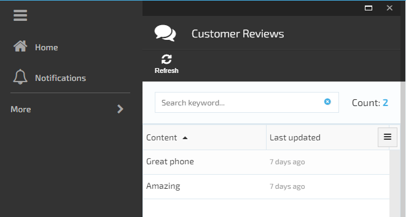
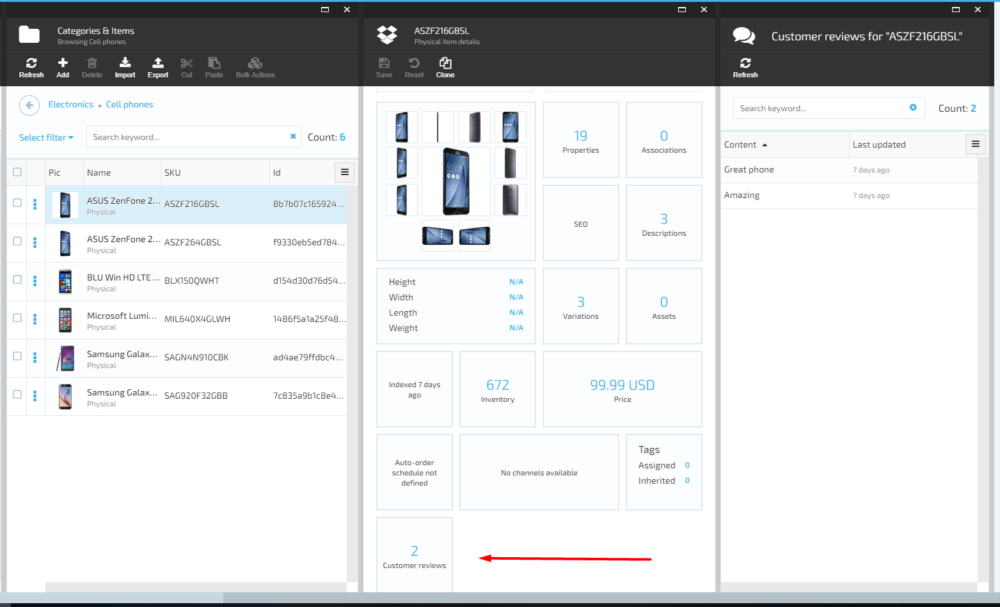

# How to build and customize Platform Manager Web UI (Angular)

## Summary

Use this guide to create Platform Manager UI for the Virto Commerce "Customer Reviews" module (created in the [Lesson 3](/lesson3.md)). There will be a UI created for the list and view product reviews.

After completing this lesson, a Platform Manager UI for the Virto Commerce "Customer Reviews" module will be created, including:

* blade with the customer reviews list for products;
* widget on the product page to view the number of reviews and open the new reviews blade for the product.

## Video

https://web.microsoftstream.com/video/43fd5a0a-d482-4de9-93af-4e0ad0837601  

## Prerequisites

* Installed Virto Commerce Platform Manager
* Visual Studio 2017 or higher
* Basic JavaScript (Angular) knowledge
* Passed [Lesson 3](/lesson3.md)

## Glossary

* JS – JavaScript;
* Platform - Virto Commerce Platform;
* Platform Manager – Virto Commerce Platform Manager, UI for Platform managing;
* VC – Virto Commerce;
* VS – Visual Studio;
* UI – User Interface.

## Platform Manager UI elements

Platform Manager provides following UI elements:

* Blade
* Toolbar
* Metaform
* Widget container

Please review this UI elements before you start creating "Customer Reviews" module UI.

### Blade

Blade is a main UI element of the Platform Manager. Every blade has basic parts such as Maximize, Close buttons on the top and the title, toolbar, main content placeholders following down. You can find out all the blade features on the [Blade constructor](https://virtocommerce.com/guides/blade-constructor)

Read more about blades in the [Blades and navigation](https://virtocommerce.com/docs/vc2devguide/working-with-platform-manager/basic-functions/blades-and-navigation) article.

### Toolbar

A blade toolbar is a dedicated area inside blade for adding commands. Hereinafter, the toolbar commands shall be referenced to as toolbar items.

Read more about toolbar in the [Blade toolbar](https://virtocommerce.com/docs/vc2devguide/working-with-platform-manager/basic-functions/blade-toolbar) article.

### Metaform

A metaform is a placeholder (container) control that renders UI content based on provided metadata.

Read more about metaform in the [Metaform](https://virtocommerce.com/docs/vc2devguide/working-with-platform-manager/basic-functions/metaform) article.

### Widget container

A widget is a relatively simple and intuitive web UI component in Platform Manager. It has the role of a transient or auxiliary tile, meaning that:

* it occupies just a portion of a blade;
* provides some useful information displayed in place;
* usually enables opening additional blade with extra information and functionality;
* is reusable and can be added to many blades (widget containers) in various places.

A widget container is a placeholder control for widgets.

Read more about widget container in the [Widgets](https://virtocommerce.com/docs/vc2devguide/working-with-platform-manager/basic-functions/widgets) article.

## Scripts debugging

To debug JS code at run-time use special debugging tools in browser. You can read more about Chrome debug tools and how to debug any JS issue in this [article](https://javascript.info/debugging-chrome). In order to enable JS debugging, change platform's Web.config, app setting **VirtoCommerce:EnableBundlesOptimizations** value to false:

```xml
<add key="VirtoCommerce:EnableBundlesOptimizations" value="false" />
```

## Build "Customer reviews" module Web UI

Platform Manager UI elements placed in **\CustomerReviewsModule.Web\Scripts** folder.

Typical structure of this folder is:

* Scripts entry point for Platform Manager user interface;
  * resources - folder contains definitions for the resources (services) available inside AngularJS module;
  * blades - folder contains AngularJS controllers and markup for the module blades;
  * widgets - folder contains AngularJS controllers and markup for the module widgets;
  * module.js - main entry point for the module UI, containing AngularJS module definition, blades and widgets registrations.

The Platform Manager also allows localizing UI elements. Localization based on resources (translation files) files placed in *\CustomerReviewsModule.Web\Localizations* folder.

### How to define blade for "Customer reviews" module

1. To get and update data from backend define *search* and *update* API controller methods in *\CustomerReviewsModule.Web\Scripts\resources\customer-reviews-module-api.js* file:

```JS
angular.module('customerReviewsModule')
    .factory('customerReviewsModule.webApi', ['$resource', function ($resource) {
        return $resource('api/CustomerReviewsModule', {}, {
            search: { method: 'POST', url: 'api/customerReviewsModule/search' },
            update: { method: 'PUT' }
        });
}]);

```

2. To show a Customer reviews list in a blade create a new *reviews-list.tpl.html* blade markup file in *\CustomerReviewsModule.Web\Scripts\blades* folder:

```html
<div class="blade-static">
    <div class="form-group">
        <div class="form-input __search">
            <input placeholder="{{'platform.placeholders.search-keyword' | translate}}" ng-model="filter.keyword" ng-keyup="$event.which === 13 && filter.criteriaChanged()" />
            <button class="btn __other" style="position: relative;right: 45px;">
                <i class="btn-ico fa fa-times-circle" title="Clear" ng-click="filter.keyword=null;filter.criteriaChanged()"></i>
            </button>
        </div>
        <p class="form-count">{{ 'platform.list.count' | translate }}: <span class="count">{{pageSettings.totalItems | number:0}}</span></p>
    </div>
</div>
<div class="blade-static __bottom" ng-if="pageSettings.itemsPerPageCount < pageSettings.totalItems" ng-include="'pagerTemplate.html'"></div>
<div class="blade-content">
    <div class="blade-inner">
        <div class="inner-block">
            <div class="table-wrapper" ng-init="setGridOptions({
                    useExternalSorting: true,
                    rowTemplate: 'list.row.html',
                    columnDefs: [
                                { name: 'content', displayName: 'customerReviewsModule.blades.review-list.labels.content' },
                                { name: 'modifiedDate', displayName: 'customerReviewsModule.blades.review-list.labels.modifiedDate', sort: { direction: uiGridConstants.DESC }}
                        ]})">
                <div ui-grid="gridOptions" ui-grid-auto-resize ui-grid-save-state ui-grid-selection ui-grid-resize-columns ui-grid-move-columns ui-grid-pinning ui-grid-height></div>
            </div>
            <p class="note" ng-if="!blade.currentEntities.length">{{ 'customerReviewsModule.blades.review-list.labels.no-review' | translate }}</p>
        </div>
    </div>
</div>

<script type="text/ng-template" id="list.row.html">
    <div ng-click="grid.appScope.blade.selectNode(row.entity)" ng-repeat="(colRenderIndex, col) in colContainer.renderedColumns track by col.uid" ui-grid-one-bind-id-grid="rowRenderIndex + '-' + col.uid + '-cell'" class="ui-grid-cell" ng-class="{'ui-grid-row-header-cell': col.isRowHeader, '__hovered': grid.appScope.contextMenuEntity === row.entity, '__selected': row.entity.id===grid.appScope.selectedNodeId }" role="{{col.isRowHeader ? 'rowheader' : 'gridcell' }}" ui-grid-cell></div>
</script>
```

3. Create a new *reviews-list.js* blade JS file in *\CustomerReviewsModule.Web\Scripts\blades* folder and define *customerReviewsModule.reviewsListController* by adding code to the *reviews-list.js* file:

```JS
angular.module('customerReviewsModule')
    .controller('customerReviewsModule.reviewsListController', ['$scope', 'customerReviewsModule.webApi', 'platformWebApp.bladeUtils', 'uiGridConstants', 'platformWebApp.uiGridHelper',
        function ($scope, reviewsApi, bladeUtils, uiGridConstants, uiGridHelper) {
            $scope.uiGridConstants = uiGridConstants;

            var blade = $scope.blade;
            var bladeNavigationService = bladeUtils.bladeNavigationService;

            blade.getSearchCriteria = function () {
                return angular.extend(filter, {
                    searchPhrase: filter.keyword ? filter.keyword : undefined,
                    sort: uiGridHelper.getSortExpression($scope),
                    skip: ($scope.pageSettings.currentPage - 1) * $scope.pageSettings.itemsPerPageCount,
                    take: $scope.pageSettings.itemsPerPageCount
                });
            };

            blade.refresh = function () {
                blade.isLoading = true;
                reviewsApi.search(blade.getSearchCriteria(), function (data) {
                    blade.isLoading = false;
                    $scope.pageSettings.totalItems = data.totalCount;
                    blade.currentEntities = data.results;
                });
            };


            blade.headIcon = 'fa-comments';

            blade.toolbarCommands = [
                {
                    name: "platform.commands.refresh", icon: 'fa fa-refresh',
                    executeMethod: blade.refresh,
                    canExecuteMethod: function () {
                        return true;
                    }
                }
            ];

            // simple and advanced filtering
            var filter = $scope.filter = blade.filter || {};

            filter.criteriaChanged = function () {
                if ($scope.pageSettings.currentPage > 1) {
                    $scope.pageSettings.currentPage = 1;
                } else {
                    blade.refresh();
                }
            };

            // ui-grid
            $scope.setGridOptions = function (gridOptions) {
                uiGridHelper.initialize($scope, gridOptions, function (gridApi) {
                    uiGridHelper.bindRefreshOnSortChanged($scope);
                });
                bladeUtils.initializePagination($scope.$parent);
            };

        }]);
```

4. Register a created controller in the Angular module by editing *\CustomerReviewsModule.Web\Scripts\module.js*:

```JS
~~~
angular.module(moduleName, [])
    .config(['$stateProvider', '$urlRouterProvider',
        function ($stateProvider, $urlRouterProvider) {
            $stateProvider
                .state('workspace.customerReviewsModuleState', {
                    url: '/customerReviewsModule',
                    templateUrl: '$(Platform)/Scripts/common/templates/home.tpl.html',
                    controller: [
                        '$scope', 'platformWebApp.bladeNavigationService', function ($scope, bladeNavigationService) {
                            var newBlade = {
                                id: 'reviewsList',
                                controller: 'customerReviewsModule.reviewsListController',
                                template: 'Modules/$(CustomerReviewsModule)/Scripts/blades/reviews-list.tpl.html',
                                isClosingDisabled: true
                            };
                            bladeNavigationService.showBlade(newBlade);
                        }
                    ]
                });
        }
    ])

~~~
```

5. Define controller permissions by editing *\CustomerReviewsModule.Web\Scripts\module.js*:

```JS
 ~~~
  .run(['$rootScope', 'platformWebApp.mainMenuService', 'platformWebApp.widgetService', '$state',
        function ($rootScope, mainMenuService, widgetService, $state) {
            //Register module in main menu
            var menuItem = {
                path: 'browse/customerReviewsModule',
                icon: 'fa fa-comments',
                title: 'Customer Reviews',
                priority: 100,
                action: function () { $state.go('workspace.customerReviewsModuleState') },
                permission: 'CustomerReviewsModule:read'
            };
            mainMenuService.addMenuItem(menuItem);
        }
    ]);
~~~
```

6. Delete *\CustomerReviewsModule.Web\Scripts\blades\hello-world.html* and *\CustomerReviewsModule.Web\Scripts\blades\hello-world.js* files

Save all changes, restart application and open blade in main menu. You should see existing Customer reviews list.



### How to define widget for "Customer reviews" module

1. Add new *widgets* folder in *\CustomerReviewsModule.Web\Scripts* folder.

2. Create a new *customerReviewWidget.js* widget JS file in *\CustomerReviewsModule.Web\Scripts\widgets* folder and define *customerReviewsModule.customerReviewWidgetController* by adding code to the *customerReviewWidget.js*:

```JS
angular.module('customerReviewsModule')
    .controller('customerReviewsModule.customerReviewWidgetController', ['$scope', 'customerReviewsModule.webApi', 'platformWebApp.bladeNavigationService', function ($scope, reviewsApi, bladeNavigationService) {
        var blade = $scope.blade;
        var filter = { take: 0 };

        function refresh() {
            $scope.loading = true;
            reviewsApi.search(filter, function (data) {
                $scope.loading = false;
                $scope.totalCount = data.totalCount;
            });
        }

        $scope.openBlade = function () {
            if ($scope.loading || !$scope.totalCount)
                return;

            var newBlade = {
                id: "reviewsList",
                filter: filter,
                title: 'Customer reviews for "' + blade.title + '"',
                controller: 'customerReviewsModule.reviewsListController',
                template: 'Modules/$(CustomerReviewsModule)/Scripts/blades/reviews-list.tpl.html'
            };
            bladeNavigationService.showBlade(newBlade, blade);
        };

        $scope.$watch("blade.itemId", function (id) {
            filter.productIds = [id];

            if (id) refresh();
        });
    }]);
```


3. Create a new *customerReviewWidget.tpl.html* widget markup file in *\CustomerReviewsModule.Web\Scripts\widgets* folder:

```html
<div class="gridster-cnt" ng-click="openBlade()">
    <div class="cnt-inner">
        <div class="list-count" ng-if="loading">...</div>
        <div class="list-count" ng-if="!loading">{{ totalCount }}</div>
        <div class="list-t" ng-if="!loading">{{ 'customerReviews.widgets.item-detail.title' | translate }}</div>
    </div>
</div>
```

4. Add widget to a Product detail blade, register a new widget in *module.js*:

```JS
~~~
.run(['$rootScope', 'platformWebApp.mainMenuService', 'platformWebApp.widgetService', '$state',
    function ($rootScope, mainMenuService, widgetService, $state) {
        //Register module in main menu
        var menuItem = {
            path: 'browse/customerReviews',
            icon: 'fa fa-comments',
            title: 'Customer Reviews',
            priority: 100,
            action: function () { $state.go('workspace.customerReviews') },
            permission: 'customerReview:read'
        };
        mainMenuService.addMenuItem(menuItem);

        //Register reviews widget inside product blade
        var itemReviewsWidget = {
            controller: 'customerReviewsModule.customerReviewWidgetController',
            template: 'Modules/$(CustomerReviewsModule)/Scripts/widgets/customerReviewWidget.tpl.html'
        };
        widgetService.registerWidget(itemReviewsWidget, 'itemDetail');
    }
]);
~~~
```

6. Save all changes, restart application and open Product detail blade. You should see that a new widget added and shows actual number of existing reviews for the product. If you click widget, a new Customer review blade should appear with the list of Customer  review for the product.



### How to create localization for "Customer reviews" module

In order to localize a module content, you need to create blade fields and widget title description translation file in *\Localizations\en.CustomerReviewsModule.json* file.

```JSON
{
  "customerReviewsModule": {
    "blades": {
      "review-list": {
        "labels": {
          "content": "Content",
          "modifiedDate": "Last updated",
          "no-review": "No Customer Reviews found"
        }
      }
    },
    "widgets": {
      "item-detail": {
        "title": "Customer reviews"
      }
    }
  }
}
```

Read more about localization in the [Localization implementation](https://virtocommerce.com/docs/vc2devguide/working-with-platform-manager/localization-implementation) article.
